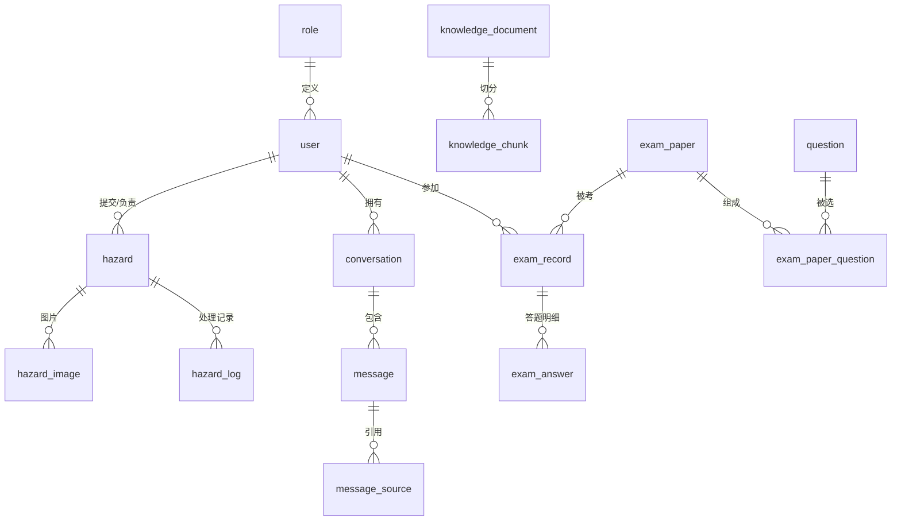

# 蜀道安全助手数据库设计（DATABASE）

| 项目 | 内容 |
| --- | --- |
| 文档名称 | 蜀道安全助手数据库设计 |
| 文档版本 | V1.0 |
| 编写日期 | 2026-08-12 |
| 文档状态 | 设计稿 |
| 关联文档 | PRD.md（产品需求）、ARCHITECTURE.md（系统架构）、AI_SOLUTION.md（AI 技术方案） |
| 目标数据库 | MySQL 8.x（InnoDB，utf8mb4） |

---

# 1. 设计原则

1. 用户数据统一管理，业务模块数据隔离。
2. 支持数据追踪和审计（隐患处理全程留痕）。
3. 满足 AI 能力扩展（知识文档、切片、引用来源）。
4. 采用逻辑外键 + 索引维护关联关系，不强制物理外键，便于扩展与性能优化。
5. 所有表统一主键 `id bigint AUTO_INCREMENT`，统一时间字段命名。

---

# 2. 数据模块与 ER 关系

## 2.1 整体 ER 图



## 2.2 核心表清单

| 模块 | 表 | 说明 |
| --- | --- | --- |
| 用户权限 | role | 角色 |
| 用户权限 | user | 用户 |
| 隐患管理 | hazard | 隐患主表 |
| 隐患管理 | hazard_image | 隐患图片 |
| 隐患管理 | hazard_log | 隐患处理记录 |
| AI 助手 | conversation | 会话 |
| AI 助手 | message | 消息 |
| AI 助手 | message_source | 回答引用来源 |
| AI 助手 | knowledge_document | 知识库文档 |
| AI 助手 | knowledge_chunk | 知识切片索引 |
| 考试工坊 | question | 题库 |
| 考试工坊 | exam_paper | 试卷 |
| 考试工坊 | exam_paper_question | 试卷-题目关联 |
| 考试工坊 | exam_record | 考试记录 |
| 考试工坊 | exam_answer | 答题明细（错题回顾） |

---

# 3. 用户权限模块

## 3.1 role 角色表

| 字段 | 类型 | 约束 | 说明 |
| --- | --- | --- | --- |
| id | bigint | PK，自增 | 角色 ID |
| code | varchar(32) | 唯一，非空 | 角色编码：EMPLOYEE / SAFETY / ADMIN |
| name | varchar(32) | 非空 | 角色名称：普通员工 / 安全管理员 / 系统管理员 |
| description | varchar(255) | 可空 | 角色说明 |
| create_time | datetime | 非空 | 创建时间 |

索引：`uk_code(code)`。

## 3.2 user 用户表

| 字段 | 类型 | 约束 | 说明 |
| --- | --- | --- | --- |
| id | bigint | PK，自增 | 用户 ID |
| username | varchar(64) | 唯一，非空 | 用户名 |
| password | varchar(128) | 非空 | 密码（bcrypt 哈希） |
| name | varchar(64) | 非空 | 姓名 |
| role_id | bigint | 非空 | 角色 ID → role.id |
| phone | varchar(20) | 可空 | 手机号 |
| status | tinyint | 默认 1 | 状态：1 启用 / 0 禁用 |
| created_time | datetime | 非空 | 创建时间 |
| updated_time | datetime | 非空 | 更新时间 |

索引：`uk_username(username)`、`idx_role(role_id)`。

---

# 4. 隐患管理模块

## 4.1 枚举定义

### 隐患状态（hazard.status）

| 编码 | 中文 | 说明 |
| --- | --- | --- |
| WAIT_PROCESS | 待处理 | 员工提交，等待处理 |
| PROCESSING | 处理中 | 已分配责任人 |
| WAIT_CHECK | 待验收 | 整改完成，等待审核 |
| FINISHED | 已闭环 | 验收通过 |
| REJECTED | 已驳回 | 整改不符合要求，重新处理 |

### 隐患等级（hazard.level）

`CRITICAL`（重大）/ `MAJOR`（较大）/ `GENERAL`（一般）/ `MINOR`（轻微）

### 隐患类型（hazard.type）

按企业分类维护，例如：高处作业、用电安全、机械伤害、消防、临边防护、其他。

## 4.2 hazard 隐患表

| 字段 | 类型 | 约束 | 说明 |
| --- | --- | --- | --- |
| id | bigint | PK，自增 | 隐患 ID |
| hazard_no | varchar(32) | 唯一，非空 | 隐患编号（提交时生成） |
| title | varchar(128) | 非空 | 隐患标题 |
| description | text | 非空 | 问题描述 |
| location | varchar(128) | 非空 | 发生位置 |
| level | varchar(16) | 非空 | 隐患等级 |
| type | varchar(32) | 非空 | 隐患类型 |
| status | varchar(16) | 非空，默认 WAIT_PROCESS | 当前状态 |
| creator_id | bigint | 非空 | 提交人 → user.id |
| handler_id | bigint | 可空 | 整改负责人 → user.id |
| deadline | datetime | 可空 | 整改期限 |
| rectification_measure | text | 可空 | 整改措施（整改反馈） |
| rectification_images | text | 可空 | 整改后照片 URL（逗号分隔） |
| reject_reason | varchar(255) | 可空 | 验收驳回原因 |
| risk_report | json | 可空 | AI 图片识别报告（V2 预留，标签/置信度/建议） |
| create_time | datetime | 非空 | 创建时间 |
| update_time | datetime | 非空 | 更新时间 |

索引：`uk_hazard_no(hazard_no)`、`idx_status(status)`、`idx_level(level)`、`idx_creator(creator_id)`、`idx_handler(handler_id)`、`idx_create_time(create_time)`。

## 4.3 hazard_image 隐患图片表

| 字段 | 类型 | 约束 | 说明 |
| --- | --- | --- | --- |
| id | bigint | PK，自增 | 图片 ID |
| hazard_id | bigint | 非空 | 隐患 ID → hazard.id |
| image_url | varchar(255) | 非空 | 图片地址 |
| uploader_id | bigint | 非空 | 上传人 → user.id |
| create_time | datetime | 非空 | 上传时间 |

索引：`idx_hazard(hazard_id)`。

## 4.4 hazard_log 隐患处理记录表

| 字段 | 类型 | 约束 | 说明 |
| --- | --- | --- | --- |
| id | bigint | PK，自增 | 记录 ID |
| hazard_id | bigint | 非空 | 隐患 ID → hazard.id |
| operator_id | bigint | 非空 | 操作人 → user.id |
| operation | varchar(64) | 非空 | 操作内容：提交/派单/整改/验收/驳回 |
| old_status | varchar(16) | 可空 | 原状态 |
| new_status | varchar(16) | 可空 | 新状态 |
| remark | varchar(255) | 可空 | 备注（整改说明等） |
| create_time | datetime | 非空 | 操作时间 |

索引：`idx_hazard(hazard_id)`、`idx_operator(operator_id)`。

---

# 5. AI 助手模块

## 5.1 conversation 会话表

| 字段 | 类型 | 约束 | 说明 |
| --- | --- | --- | --- |
| id | bigint | PK，自增 | 会话 ID |
| user_id | bigint | 非空 | 用户 ID → user.id |
| title | varchar(128) | 非空 | 会话标题（默认取首个问题） |
| created_time | datetime | 非空 | 创建时间 |
| updated_time | datetime | 非空 | 更新时间 |

索引：`idx_user(user_id)`、`idx_updated(updated_time)`。

## 5.2 message 消息表

| 字段 | 类型 | 约束 | 说明 |
| --- | --- | --- | --- |
| id | bigint | PK，自增 | 消息 ID |
| conversation_id | bigint | 非空 | 会话 ID → conversation.id |
| role | varchar(16) | 非空 | user / assistant |
| content | mediumtext | 非空 | 消息内容 |
| token_count | int | 默认 0 | Token 数量 |
| status | varchar(16) | 非空，默认 SUCCESS | 生成状态：SUCCESS / FAILED / GENERATING |
| create_time | datetime | 非空 | 时间 |

索引：`idx_conversation(conversation_id)`。

## 5.3 message_source 回答引用来源表

支撑 PRD 中“回答来源引用”与接口 `GET /api/v1/ai/source/{message_id}`。

| 字段 | 类型 | 约束 | 说明 |
| --- | --- | --- | --- |
| id | bigint | PK，自增 | 引用 ID |
| message_id | bigint | 非空 | AI 回答消息 ID → message.id |
| document_id | bigint | 非空 | 来源文档 → knowledge_document.id |
| chunk_id | bigint | 非空 | 来源切片 → knowledge_chunk.id |
| document_name | varchar(255) | 非空 | 文档名称 |
| chapter | varchar(128) | 可空 | 章节 |
| content | text | 非空 | 原文片段 |
| score | decimal(6,4) | 可空 | 重排得分 |

索引：`idx_message(message_id)`。

## 5.4 knowledge_document 知识库文档表

| 字段 | 类型 | 约束 | 说明 |
| --- | --- | --- | --- |
| id | bigint | PK，自增 | 文档 ID |
| name | varchar(255) | 非空 | 文件名称 |
| type | varchar(16) | 非空 | 文件类型：pdf / docx / txt / ppt 等 |
| path | varchar(255) | 非空 | 文件路径 |
| status | varchar(16) | 非空 | 处理状态 |
| chunk_count | int | 默认 0 | 切片数量 |
| uploader_id | bigint | 非空 | 上传人 → user.id |
| create_time | datetime | 非空 | 创建时间 |
| update_time | datetime | 非空 | 更新时间 |

处理状态（status）：`PENDING`（待处理）/ `PROCESSING`（处理中）/ `SUCCESS`（成功）/ `FAILED`（失败）。

## 5.5 knowledge_chunk 知识切片索引表

| 字段 | 类型 | 约束 | 说明 |
| --- | --- | --- | --- |
| id | bigint | PK，自增 | 切片 ID |
| document_id | bigint | 非空 | 文档 ID → knowledge_document.id |
| content | text | 非空 | 文本内容 |
| chapter | varchar(128) | 可空 | 所属章节 |
| page_no | int | 可空 | 页码 |
| seq | int | 非空 | 切片顺序 |
| vector_id | varchar(64) | 唯一 | 向量库中的向量 ID |
| create_time | datetime | 非空 | 创建时间 |

索引：`idx_document(document_id)`、`uk_vector(vector_id)`。

> 说明：向量数据实际存储于向量数据库（开发环境 Chroma，生产环境 Milvus），本表保存文本与向量 ID 的映射索引。

---

# 6. 考试工坊模块

## 6.1 枚举定义

### 题型（question.type）

`SINGLE`（单选）/ `MULTIPLE`（多选）/ `JUDGE`（判断）/ `FILL`（填空）

### 难度（question.difficulty）

`EASY`（简单）/ `MEDIUM`（中等）/ `HARD`（困难）

### 创建方式（question.source）

`manual`（人工录入）/ `ai`（AI 生成）

### 审核状态（question.status）

| 编码 | 中文 | 说明 |
| --- | --- | --- |
| PENDING | 待审核 | AI 生成草稿，未入正式题库，组卷不可选 |
| APPROVED | 已通过 | 人工审核通过，入库可用 |
| REJECTED | 已驳回 | 审核不通过，可修改后重新提交或删除 |
| DISABLED | 已停用 | 已通过后被人工停用（抽查发现问题下架），不入卷 |

> 人工录入（source=manual）直接以 APPROVED 入库；AI 生成（source=ai）以 PENDING 入草稿，经审核（E02）后转 APPROVED/REJECTED。

#### 重写流转（E02 增强：方案B，AI 带反馈重写）

- 仅 `source=ai` 且 `status=REJECTED` 的题目可发起重写；**原题状态不变**（保留驳回审计留痕，不参与组卷）。
- 重写 = 把「原题 + 驳回意见 `review_note` + 本次修订要求 `feedback` + 相关法规条款」回喂 LLM，产出**修订版新题**：`source=ai`、`status=PENDING`、`rewrite_of=原题 id`、`rewrite_feedback=feedback`，独立成新 batch（`ai_` 前缀）重新走常规审核。
- 同一原题至多一条**待审**修订版：DB 层生成列 `rewrite_pending` + 唯一键 `uk_rewrite_pending` 兜底并发（重复请求映射 409）。
- 存在待审/已通过的修订版时，**禁止直接复核原题通过**（400），避免同一逻辑题重复入卷。
- 修订版审核通过即 APPROVED 可组卷；原 REJECTED 题如需彻底移除走 E01 删除接口。

### 题型作答约定（options / answer 存储格式）

| 题型 | options | answer |
| --- | --- | --- |
| SINGLE 单选 | `["A 选项","B 选项",…]` | 选项标签大写，如 `A` |
| MULTIPLE 多选 | `["A 选项","B 选项",…]` | 逗号连接，如 `A,C`（全对才得分） |
| JUDGE 判断 | 固定 `["A 正确","B 错误"]` | `A` 或 `B` |
| FILL 填空 | 置空 `null` | 多空用分号（`;`）分隔，如 `安全第一;预防为主` |

> 所有题型 answer 均为字符串。FILL 多空答案顺序与题面空格一一对应；录入/更新时按此格式校验（见 E01 接口）。

## 6.2 question 题库表

| 字段 | 类型 | 约束 | 说明 |
| --- | --- | --- | --- |
| id | bigint | PK，自增 | 题目 ID |
| batch_id | varchar(64) | 可空 | 生成批次 ID（E02 AI 出题一次生成=一批，支持批量入库与审核通过率统计；人工录入为空） |
| type | varchar(16) | 非空 | 题型 |
| content | text | 非空 | 题目内容 |
| options | json | 可空 | 选项（如 ["A 安全帽","B 安全带"]） |
| answer | varchar(64) | 非空 | 标准答案 |
| analysis | text | 可空 | 答案解析 |
| knowledge_point | varchar(128) | 非空 | 知识点 |
| difficulty | varchar(16) | 非空 | 难度 |
| source | varchar(16) | 非空，默认 manual | 创建方式：manual / ai |
| sources | json | 可空 | 溯源明细：`[{role: answer/distractor/analysis, law_title, article_no}]`，支撑防幻觉与抽样抽检 |
| source_law_title | varchar(255) | 可空 | 主要依据法规名称（快速筛选/展示） |
| source_article_no | varchar(32) | 可空 | 主要依据条文号（如 第五十条） |
| status | varchar(16) | 非空，默认 PENDING | 审核状态：PENDING / APPROVED / REJECTED / DISABLED |
| reviewer | bigint | 可空 | 审核人 → user.id |
| review_note | varchar(255) | 可空 | 审核意见（驳回原因等） |
| interference_verified | tinyint | 非空，默认 0 | 干扰项已核实：1=审核人确认错误选项确为错误（E02 内控抽查基础） |
| rewrite_of | bigint | 可空 | 重写链：非空=修订自某题 id（E02 重写增强），支撑「修订自#id」展示与审计 |
| rewrite_feedback | varchar(255) | 可空 | 重写请求的修订要求原文（留痕） |
| rewrite_pending | bigint | 生成列 | 仅当该行是「待审(PENDING)的重写题」时=原题 id，其余为 NULL；配合唯一键保证一题至多一条待审重写 |
| create_time | datetime | 非空 | 创建时间 |
| update_time | datetime | 非空 | 更新时间 |

索引：`idx_type(type)`、`idx_knowledge(knowledge_point)`、`idx_difficulty(difficulty)`、`idx_status(status)`、`idx_batch(batch_id)`、`idx_rewrite_of(rewrite_of)`、唯一键 `uk_rewrite_pending(rewrite_pending)`。

## 6.3 exam_paper 试卷表

| 字段 | 类型 | 约束 | 说明 |
| --- | --- | --- | --- |
| id | bigint | PK，自增 | 试卷 ID |
| name | varchar(128) | 非空 | 试卷名称 |
| total_score | int | 非空，默认 100 | 总分 |
| pass_score | int | 非空，默认 60 | 合格分数线 |
| duration | int | 非空 | 考试时长（分钟），PRD 验收 30/60/90 |
| question_count | int | 非空 | 题目数量 |
| difficulty_ratio | json | 可空 | 组卷配置留痕（AI 组卷写入规则：rules + knowledge_points） |
| gen_mode | varchar(8) | 非空，默认 manual | 组卷方式：manual 手动组卷 / ai 智能组卷 |
| status | varchar(16) | 非空，默认 DRAFT | 试卷状态：DRAFT 草稿 / PUBLISHED 已发布 / DISABLED 已停用 |
| creator_id | bigint | 非空 | 创建人 → user.id |
| create_time | datetime | 非空 | 创建时间 |

索引：`idx_status(status)`。

## 6.4 exam_paper_question 试卷-题目关联表

支撑“手动组卷 + AI 智能组卷”的试卷结构。

| 字段 | 类型 | 约束 | 说明 |
| --- | --- | --- | --- |
| id | bigint | PK，自增 | 关联 ID |
| paper_id | bigint | 非空 | 试卷 ID → exam_paper.id |
| question_id | bigint | 非空 | 题目 ID → question.id |
| score | int | 非空 | 该题分值 |
| seq | int | 非空 | 题目顺序 |

索引：`idx_paper(paper_id)`。

## 6.5 exam_record 考试记录表

| 字段 | 类型 | 约束 | 说明 |
| --- | --- | --- | --- |
| id | bigint | PK，自增 | 记录 ID |
| paper_id | bigint | 非空 | 试卷 ID → exam_paper.id |
| user_id | bigint | 非空 | 用户 ID → user.id |
| score | int | 非空，默认 0 | 成绩（交卷后由阅卷写入） |
| status | varchar(16) | 非空，默认 '' | 结果：PASS / FAIL / ''（未评分） |
| state | varchar(16) | 非空，默认 ONGOING | 生命周期：ONGOING（进行中）/ SUBMITTED（已交卷终态） |
| cheat_count | int | 非空，默认 0 | 服务端权威切屏计数（max 合并前端上报） |
| submit_reason | varchar(16) | 可空 | 交卷原因：manual / timeout / cheat_limit（留痕） |
| start_time | datetime | 非空，默认 NOW | 开始时间 |
| end_time | datetime | 可空 | 结束时间（交卷时写入） |

索引：`idx_user(user_id)`、`idx_paper(paper_id)`、唯一键 `uk_user_paper_ongoing(ongoing_key)`。

唯一键基于**生成列** `ongoing_key`（STORED，表达式 `IF(state='ONGOING', CONCAT(user_id,'-',paper_id), NULL)`）：仅 ONGOING 记录参与唯一（DB 级防同用户同试卷重复开考，并发 start 兜底），SUBMITTED 记录生成列为 NULL、不参与唯一 → 允许同用户同试卷重考/多次交卷历史。ORM 不映射该列，由 DB 自动维护。

## 6.6 exam_answer 答题明细表

支撑“错题记录、错题回顾、知识点掌握度统计”。`user_answer`/`correct_answer` 存规范化后串（见 §6.1 作答约定），宽度 255 适配填空多空中文答案；`is_correct`/`score` 保存阶段占位 0，交卷时由阅卷覆写权威值。

| 字段 | 类型 | 约束 | 说明 |
| --- | --- | --- | --- |
| id | bigint | PK，自增 | 明细 ID |
| record_id | bigint | 非空 | 考试记录 ID → exam_record.id |
| question_id | bigint | 非空 | 题目 ID → question.id |
| user_answer | varchar(255) | 非空 | 用户答案（规范化后；未作答=''） |
| correct_answer | varchar(255) | 非空 | 正确答案 |
| is_correct | tinyint | 非空，默认 0 | 1 正确 / 0 错误 |
| score | int | 非空，默认 0 | 本题得分 |

索引：`idx_record(record_id)`、
唯一键 `uk_record_question(record_id, question_id)`——INSERT..ON DUPLICATE KEY UPDATE 的幂等 upsert 锚点（每 (record_id,question_id) 仅一行）。

---

# 7. 索引设计汇总

| 表 | 索引 | 用途 |
| --- | --- | --- |
| role | uk_code | 角色编码唯一 |
| user | uk_username / idx_role | 登录、按角色查询 |
| hazard | uk_hazard_no / idx_status / idx_level / idx_creator / idx_handler / idx_create_time | 编号、筛选、统计 |
| hazard_image | idx_hazard | 隐患图片查询 |
| hazard_log | idx_hazard / idx_operator | 时间线、审计 |
| conversation | idx_user / idx_updated | 我的会话 |
| message | idx_conversation | 会话消息 |
| message_source | idx_message | 引用来源 |
| knowledge_document | idx_status | 文档处理 |
| knowledge_chunk | idx_document / uk_vector | 文档切片、向量映射 |
| question | idx_type / idx_knowledge / idx_difficulty / idx_status / idx_batch | 题库筛选、审核、批次统计 |
| exam_paper | idx_status | 试卷列表筛选 |
| exam_paper_question | idx_paper | 试卷题目 |
| exam_record | idx_user / idx_paper / uk_user_paper_ongoing | 考试记录、并发开考防重 |
| exam_answer | idx_record / uk_record_question | 答题明细、幂等 upsert 锚点 |

---

# 8. 初始化数据

## 8.1 角色

| id | code | name |
| --- | --- | --- |
| 1 | EMPLOYEE | 普通员工 |
| 2 | SAFETY | 安全管理员 |
| 3 | ADMIN | 系统管理员 |

## 8.2 管理员账号

```text
username: admin
password: Admin@123456（bcrypt 哈希后存储）
role: ADMIN
```

---

# 9. 建表 SQL

以下 DDL 为 MySQL 8.x 完整建表脚本，亦将同步维护到 `database/schema.sql`。

```sql
CREATE DATABASE IF NOT EXISTS shudao DEFAULT CHARACTER SET utf8mb4 COLLATE utf8mb4_unicode_ci;
USE shudao;

-- 角色表
CREATE TABLE role (
  id          BIGINT AUTO_INCREMENT PRIMARY KEY,
  code        VARCHAR(32)  NOT NULL,
  name        VARCHAR(32)  NOT NULL,
  description VARCHAR(255) NULL,
  create_time DATETIME     NOT NULL DEFAULT CURRENT_TIMESTAMP,
  UNIQUE KEY uk_code (code)
) ENGINE = InnoDB;

-- 用户表
CREATE TABLE user (
  id           BIGINT AUTO_INCREMENT PRIMARY KEY,
  username     VARCHAR(64)  NOT NULL,
  password     VARCHAR(128) NOT NULL,
  name         VARCHAR(64)  NOT NULL,
  role_id      BIGINT       NOT NULL,
  phone        VARCHAR(20)  NULL,
  status       TINYINT      NOT NULL DEFAULT 1,
  created_time DATETIME     NOT NULL DEFAULT CURRENT_TIMESTAMP,
  updated_time DATETIME     NOT NULL DEFAULT CURRENT_TIMESTAMP ON UPDATE CURRENT_TIMESTAMP,
  UNIQUE KEY uk_username (username),
  KEY idx_role (role_id)
) ENGINE = InnoDB;

-- 隐患表
CREATE TABLE hazard (
  id                   BIGINT AUTO_INCREMENT PRIMARY KEY,
  hazard_no            VARCHAR(32)  NOT NULL,
  title                VARCHAR(128) NOT NULL,
  description          TEXT         NOT NULL,
  location             VARCHAR(128) NOT NULL,
  level                VARCHAR(16)  NOT NULL,
  type                 VARCHAR(32)  NOT NULL,
  status               VARCHAR(16)  NOT NULL DEFAULT 'WAIT_PROCESS',
  creator_id           BIGINT       NOT NULL,
  handler_id           BIGINT       NULL,
  deadline             DATETIME     NULL,
  rectification_measure TEXT        NULL,
  rectification_images TEXT         NULL,
  reject_reason        VARCHAR(255) NULL,
  risk_report          JSON         NULL,
  create_time          DATETIME     NOT NULL DEFAULT CURRENT_TIMESTAMP,
  update_time          DATETIME     NOT NULL DEFAULT CURRENT_TIMESTAMP ON UPDATE CURRENT_TIMESTAMP,
  UNIQUE KEY uk_hazard_no (hazard_no),
  KEY idx_status (status),
  KEY idx_level (level),
  KEY idx_creator (creator_id),
  KEY idx_handler (handler_id),
  KEY idx_create_time (create_time)
) ENGINE = InnoDB;

-- 隐患图片表
CREATE TABLE hazard_image (
  id          BIGINT AUTO_INCREMENT PRIMARY KEY,
  hazard_id   BIGINT       NOT NULL,
  image_url   VARCHAR(255) NOT NULL,
  uploader_id BIGINT       NOT NULL,
  create_time DATETIME     NOT NULL DEFAULT CURRENT_TIMESTAMP,
  KEY idx_hazard (hazard_id)
) ENGINE = InnoDB;

-- 隐患处理记录表
CREATE TABLE hazard_log (
  id          BIGINT AUTO_INCREMENT PRIMARY KEY,
  hazard_id   BIGINT       NOT NULL,
  operator_id BIGINT       NOT NULL,
  operation   VARCHAR(64)  NOT NULL,
  old_status  VARCHAR(16)  NULL,
  new_status  VARCHAR(16)  NULL,
  remark      VARCHAR(255) NULL,
  create_time DATETIME     NOT NULL DEFAULT CURRENT_TIMESTAMP,
  KEY idx_hazard (hazard_id),
  KEY idx_operator (operator_id)
) ENGINE = InnoDB;

-- 会话表
CREATE TABLE conversation (
  id           BIGINT AUTO_INCREMENT PRIMARY KEY,
  user_id      BIGINT       NOT NULL,
  title        VARCHAR(128) NOT NULL,
  created_time DATETIME     NOT NULL DEFAULT CURRENT_TIMESTAMP,
  updated_time DATETIME     NOT NULL DEFAULT CURRENT_TIMESTAMP ON UPDATE CURRENT_TIMESTAMP,
  KEY idx_user (user_id),
  KEY idx_updated (updated_time)
) ENGINE = InnoDB;

-- 消息表
CREATE TABLE message (
  id              BIGINT AUTO_INCREMENT PRIMARY KEY,
  conversation_id BIGINT       NOT NULL,
  role            VARCHAR(16)  NOT NULL,
  content         MEDIUMTEXT   NOT NULL,
  token_count     INT          NOT NULL DEFAULT 0,
  status          VARCHAR(16)  NOT NULL DEFAULT 'SUCCESS',
  create_time     DATETIME     NOT NULL DEFAULT CURRENT_TIMESTAMP,
  KEY idx_conversation (conversation_id)
) ENGINE = InnoDB;

-- 回答引用来源表
CREATE TABLE message_source (
  id            BIGINT AUTO_INCREMENT PRIMARY KEY,
  message_id    BIGINT       NOT NULL,
  document_id   BIGINT       NOT NULL,
  chunk_id      BIGINT       NOT NULL,
  document_name VARCHAR(255) NOT NULL,
  chapter       VARCHAR(128) NULL,
  content       TEXT         NOT NULL,
  score         DECIMAL(6,4) NULL,
  KEY idx_message (message_id)
) ENGINE = InnoDB;

-- 知识库文档表
CREATE TABLE knowledge_document (
  id          BIGINT AUTO_INCREMENT PRIMARY KEY,
  name        VARCHAR(255) NOT NULL,
  type        VARCHAR(16)  NOT NULL,
  path        VARCHAR(255) NOT NULL,
  status      VARCHAR(16)  NOT NULL DEFAULT 'PENDING',
  chunk_count INT          NOT NULL DEFAULT 0,
  uploader_id BIGINT       NOT NULL,
  create_time DATETIME     NOT NULL DEFAULT CURRENT_TIMESTAMP,
  update_time DATETIME     NOT NULL DEFAULT CURRENT_TIMESTAMP ON UPDATE CURRENT_TIMESTAMP,
  KEY idx_status (status)
) ENGINE = InnoDB;

-- 知识切片索引表
CREATE TABLE knowledge_chunk (
  id          BIGINT AUTO_INCREMENT PRIMARY KEY,
  document_id BIGINT      NOT NULL,
  content     TEXT        NOT NULL,
  chapter     VARCHAR(128) NULL,
  page_no     INT         NULL,
  seq         INT         NOT NULL,
  vector_id   VARCHAR(64) NOT NULL,
  create_time DATETIME    NOT NULL DEFAULT CURRENT_TIMESTAMP,
  KEY idx_document (document_id),
  UNIQUE KEY uk_vector (vector_id)
) ENGINE = InnoDB;

-- 题库表
CREATE TABLE question (
  id                    BIGINT AUTO_INCREMENT PRIMARY KEY,
  batch_id              VARCHAR(64)  NULL,
  type                  VARCHAR(16)  NOT NULL,
  content               TEXT         NOT NULL,
  options               JSON         NULL,
  answer                VARCHAR(64)  NOT NULL,
  analysis              TEXT         NULL,
  knowledge_point       VARCHAR(128) NOT NULL,
  difficulty            VARCHAR(16)  NOT NULL,
  source                VARCHAR(16)  NOT NULL DEFAULT 'manual',
  sources               JSON         NULL,
  source_law_title      VARCHAR(255) NULL,
  source_article_no     VARCHAR(32)  NULL,
  status                VARCHAR(16)  NOT NULL DEFAULT 'PENDING',
  reviewer              BIGINT       NULL,
  review_note           VARCHAR(255) NULL,
  interference_verified TINYINT      NOT NULL DEFAULT 0,
  create_time           DATETIME     NOT NULL DEFAULT CURRENT_TIMESTAMP,
  update_time           DATETIME     NOT NULL DEFAULT CURRENT_TIMESTAMP ON UPDATE CURRENT_TIMESTAMP,
  KEY idx_type (type),
  KEY idx_knowledge (knowledge_point),
  KEY idx_difficulty (difficulty),
  KEY idx_status (status),
  KEY idx_batch (batch_id)
) ENGINE = InnoDB;

-- 试卷表
CREATE TABLE exam_paper (
  id              BIGINT AUTO_INCREMENT PRIMARY KEY,
  name            VARCHAR(128) NOT NULL,
  total_score     INT          NOT NULL DEFAULT 100,
  pass_score      INT          NOT NULL DEFAULT 60,
  duration        INT          NOT NULL,
  question_count  INT          NOT NULL,
  difficulty_ratio JSON        NULL,
  creator_id      BIGINT       NOT NULL,
  create_time     DATETIME     NOT NULL DEFAULT CURRENT_TIMESTAMP
) ENGINE = InnoDB;

-- 试卷-题目关联表
CREATE TABLE exam_paper_question (
  id          BIGINT AUTO_INCREMENT PRIMARY KEY,
  paper_id    BIGINT NOT NULL,
  question_id BIGINT NOT NULL,
  score       INT    NOT NULL,
  seq         INT    NOT NULL,
  KEY idx_paper (paper_id)
) ENGINE = InnoDB;

-- 考试记录表
CREATE TABLE exam_record (
  id         BIGINT AUTO_INCREMENT PRIMARY KEY,
  paper_id   BIGINT   NOT NULL,
  user_id    BIGINT   NOT NULL,
  score      INT      NOT NULL,
  status     VARCHAR(16) NOT NULL,
  start_time DATETIME NOT NULL,
  end_time   DATETIME NOT NULL,
  KEY idx_user (user_id),
  KEY idx_paper (paper_id)
) ENGINE = InnoDB;

-- 答题明细表
CREATE TABLE exam_answer (
  id             BIGINT AUTO_INCREMENT PRIMARY KEY,
  record_id      BIGINT      NOT NULL,
  question_id    BIGINT      NOT NULL,
  user_answer    VARCHAR(64) NOT NULL,
  correct_answer VARCHAR(64) NOT NULL,
  is_correct     TINYINT     NOT NULL,
  score          INT         NOT NULL,
  KEY idx_record (record_id)
) ENGINE = InnoDB;
```

---

# 10. 后续说明

1. **向量数据**：知识切片向量存储于向量数据库（开发 Chroma / 生产 Milvus），`knowledge_chunk.vector_id` 与之关联，详见 AI_SOLUTION.md。
2. **数据归档**：`hazard_log`、`message` 等增长较快，后期按时间分表或归档。
3. **权限安全**：所有表关联用户均通过应用层校验数据归属，防止越权访问。

> 本设计依据 PRD 第 7 章展开，补充了支撑“引用来源、组卷、错题回顾、图片多图”等功能的关联表。
