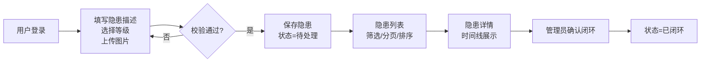
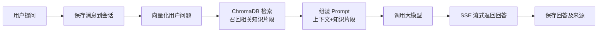
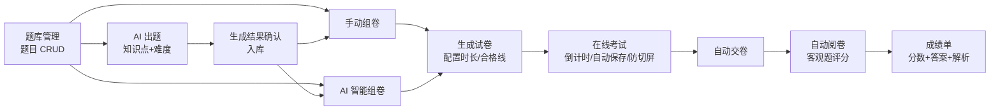

# 蜀道安全助手 产品需求文档（PRD）

| 项目名称 | 蜀道安全助手 |
| --- | --- |
| 文档版本 | v1.0.1 |
| 创建日期 | 2026-08-11 |
| 文档状态 | 修订稿（2026-08-12：内部一致性修正 + 补齐 E02 审核口径，技术栈/并发口径保持不变） |

---

## 1. 产品概述

### 1.1 项目背景

蜀道集团作为大型交通建设企业，安全生产管理是核心业务之一。为提升安全管理信息化水平、降低安全事故风险，蜀道集团规划建设「蜀道安全助手」智能化安全管理平台，运用 AI 技术赋能传统安全管理流程。

### 1.2 产品定位

构建一个面向企业员工与安全管理人员的 Web 应用「蜀道安全助手」，聚焦三大核心能力：

1. **隐患上报与查看**：让员工能够快速上报安全隐患，并查看隐患列表与详情。
2. **AI 安全问答**：基于大模型 + 企业安全知识库的智能问答，支持多轮会话与流式输出。
3. **AI 考试工坊**：AI 辅助出题 → 组卷 → 在线考试 → 自动阅卷的完整考试链路。

### 1.3 功能范围

本项目功能范围如下：

| 模块 | 范围 |
| --- | --- |
| 模块一 隐患安全管理 | H01 隐患上报、H02 隐患列表、H03 隐患详情 |
| 模块二 AI 智能助手 | A01 智能问答、A02 会话管理、A03 流式输出 |
| 模块三 考试工坊 | E01 题库管理、E02 AI 出题、E03 试卷生成、E04 在线考试、E05 自动阅卷 |
| 基础支撑 | B01 用户登录（JWT 鉴权）、B02 角色权限控制、B03 文件上传校验 |

> 本期范围：模块一 H01–H03、模块二 A01–A03、模块三 E01–E05；任务书中 P1/P2 级功能（H04–H08 派单/整改/验收/统计分析/消息通知）本期不实现。
>
> **实现现状补充（2026-08-14 核对）**：下列被旧版标注"本期不实现"的功能**已随实现落地**（代码为真源，本行修订以对齐现状，功能不减不降）：
> - A04 快捷提问：`GET /api/v1/ai/quick-questions` + 前端快捷提问 UI（backend/data/quick_questions.json）
> - E06 考试记录：`GET /api/v1/exams/records` + 前端「我的记录」页
> - E07 出题统计：`GET /api/v1/ai/stats` + 前端「出题统计」页
> - E08 题目审核：`POST /ai/questions/{qid}/review`、`/ai/batches/{batch_id}/review` + 「批次审核」页（E02 审核流）
> - 模块二另有 A07 回答反馈（`POST /ai/feedback/{message_id}`）与「查看原文」（`GET /ai/article`）
> - 模块一另有 H01 AI 视觉识别（`POST /api/v1/hazards/analyze`，未配置时 503 降级不阻断上报）
> - 模块三题库支持第 5 种题型 **SUBJECTIVE 解答题**（手动录入 + AI 出题 + 要点包含自动判分）

### 1.4 用户角色

| 角色 | 说明 | 核心权限 |
| --- | --- | --- |
| 管理员 | 系统最高权限，负责系统维护与数据管理 | 全部功能 |
| 普通用户 | 企业员工 | 隐患上报与查看、AI 问答、参加考试与查看成绩 |

---

## 2. 技术栈

> 本节为**实现真源**（2026-08-14 按代码现状修订；历史版本见 git 记录）。实现依据：`backend/requirements.txt`、`frontend/package.json`、`backend/app/**`。

| 层级 | 技术选型（实现现状） |
| --- | --- |
| 前端 | Vue3、Vite、**TypeScript**、Element Plus、Vue Router **5（^5.2.0）**、Pinia、Axios、marked + DOMPurify |
| 后端 | Python、FastAPI、SQLAlchemy、Pydantic、**python-jose（JWT）**、**httpx（openai SDK）**、asyncio、python-multipart、bcrypt |
| 数据库 | MySQL（业务数据）、**ChromaDB（本地向量库）**、Redis（**仅配置预留，未启用**，见 ARCHITECTURE §7） |
| AI 集成 | **OpenAI 兼容协议公有大模型 API（DeepSeek/Qwen 可配置）**、本地 **BGE** 系列 Embedding 与 Reranker、**LangChain 仅用于 Embedding 包装**（RAG 链为自研实现，见 RAG优化方案.md） |
| 部署 | uvicorn（后端）、Vite build（前端静态产物）；Docker/docker-compose **未落地（规划项）** |

---

## 3. 功能需求

### 3.1 基础支撑（P0）

#### B01 用户登录与注册

- 需求描述：支持用户名/密码注册与登录；密码加密存储；登录成功后签发 JWT Token，前端通过 Bearer Token 访问受保护接口。
- 用户故事：作为普通用户，我可以注册并登录系统，以便使用各模块功能。
- 验收标准：
  - 密码以哈希形式存储，不出现明文
  - 登录成功后返回 Token，过期后需要重新登录
  - 未登录访问受保护接口返回 401

#### B02 角色权限控制

- 需求描述：基于管理员/普通用户两种角色做接口级权限控制。
- 验收标准：管理员可访问全部接口；普通用户不可访问管理类接口；越权访问返回 403。

#### B03 文件上传

- 需求描述：支持隐患图片上传，仅允许常见图片格式（jpg/png/jpeg），单文件 ≤ 5MB。
- 验收标准：非图片类型或超大小文件被拒绝并提示。

---

### 3.2 模块一：隐患安全管理（P0）

#### H01 隐患上报（P0）

- 需求描述：员工提交隐患信息，支持**文字描述、图片上传、隐患等级分类**，并记录上报人、上报时间。「位置定位」为可选文本字段（手动填写或前端地图选点）。
- 隐患等级定义：

| 等级 | 说明 |
| --- | --- |
| 重大隐患 | 可能导致重大安全事故，需立即整改 |
| 较大隐患 | 可能导致较大安全事故，限期整改 |
| 一般隐患 | 一般性问题，常规整改 |
| 轻微隐患 | 轻微问题，建议整改 |

- 用户故事：作为普通用户，我可以在现场发现隐患后立即拍照并上报，以便管理员及时掌握情况。
- 验收标准：
  - 必填项校验（描述、等级）；图片可多张上传并回显
  - 上报成功后生成唯一编号，状态初始为「待处理」
  - 可提交多条上报记录

#### H02 隐患列表（P0）

- 需求描述：分页展示全部隐患，支持**多条件筛选（状态、等级、时间范围）**与**排序**。
- 用户故事：作为普通用户，我可以按等级/状态快速筛选隐患，以便优先处理高风险项。
- 验收标准：
  - 支持状态、等级、上报时间区间组合筛选
  - 支持按上报时间/等级排序，服务端分页
  - 筛选条件与分页参数变化时数据正确刷新

#### H03 隐患详情（P0）

- 需求描述：展示隐患完整信息（描述、等级、图片、上报人/时间、当前状态），并提供**处理进度时间线**（记录上报、闭环等关键节点）。
- 用户故事：作为普通用户，我可以查看某条隐患的全部信息与流转记录，以便跟进。
- 验收标准：
  - 详情页展示全部字段与图片缩略图
  - 时间线按时间倒序展示状态节点
  - 支持管理员将「待处理」隐患标记为「已闭环」

> 隐患状态流转：待处理 → 已闭环（派单、整改、验收流程不在本项目范围内）。

---

### 3.3 模块二：AI 智能助手（P0）

#### A01 智能问答（P0）

- 需求描述：基于**企业安全知识库**的自然语言问答。采用 RAG 架构：用户提问 → 向量检索（ChromaDB）召回相关知识 → 大模型基于召回内容生成回答，减少幻觉。
- 知识库范围：本期为 28 部公开安全生产法规（法律/行政法规/地方性法规/政府规章/部门规章）；企业内部制度、操作规程、事故案例属扩展层，后续经管理后台上传导入（见 RAG 方案 §1.1/§1.5）。
- 技术要求：支持上下文多轮对话（至少 5 轮，以会话内消息序列实现）；答案来源在响应中携带来源列表字段，供前端展示。
- 用户故事：作为普通用户，我可以像聊天一样询问安全规范问题，并获得基于企业制度的准确回答。
- 验收标准：
  - 提问后返回基于知识库的回答，无知识命中时明确提示「知识库中暂未找到相关内容」
  - 同一会话中可连续追问，上下文连贯

#### A02 会话管理（P0）

- 需求描述：支持**历史会话列表、新建会话、删除会话**。
- 用户故事：作为普通用户，我可以回到之前的会话继续提问。
- 验收标准：
  - 新建会话后进入空对话
  - 历史会话按更新时间倒序展示
  - 删除会话后其消息一并删除

#### A03 流式输出（P0）

- 需求描述：AI 回答通过 **SSE（Server-Sent Events）** 流式返回，前端逐字渲染，提升体验。
- 验收标准：
  - 回答过程中用户可看到逐步生成的内容
  - 流中断/异常时前端给出提示并可重试

---

### 3.4 模块三：考试工坊（AI 出题与在线考试）（P0）

#### E01 题库管理（P0）

- 需求描述：题目 **CRUD**，支持**单选、多选、判断、填空**四种题型；题目包含题干、选项、正确答案、解析、知识点标签、难度（简单/中等/困难）。
- 用户故事：作为管理员，我可以维护题库，为组卷提供素材。
- 验收标准：
  - 四种题型均可创建、编辑、删除、查询
  - 列表支持按题型/知识点/难度筛选，服务端分页
  - 正确答案与解析必填（填空题支持多个空）

#### E02 AI 出题（P0）

- 需求描述：输入**知识点/主题 + 难度**，调用大模型**自动生成考题**（带正确答案与详细解析），生成结果经人工确认后可批量加入题库。
- 用户故事：作为管理员，我可以输入「临时用电安全 + 中等难度」，快速获得一批题目草稿，人工确认后入库。
- 验收标准：
  - 一次生成不少于 5 道题，覆盖指定知识点
  - 每道题包含题干、选项（如适用）、正确答案、解析
  - 支持将生成结果批量保存进题库
  - 生成结果需经**人工审核**后入库；对外口径：审核通过率 ≥80%（直接通过 + 文案润色后通过 / 批次总数）
  - 已入库题目抽样正确率 ≥95%（内控口径，定期双人抽检）

#### E03 试卷生成（P0）

- 需求描述：支持**手动组卷**与 **AI 智能组卷**两种模式。
  - 手动组卷：从题库勾选题目组成试卷
  - AI 智能组卷：指定题型数量/知识点/难度分布，自动从题库抽题组卷
- 用户故事：作为管理员，我可以快速生成一套覆盖指定知识点的试卷用于考试。
- 验收标准：
  - 两种模式均可生成试卷并预览试卷题目列表
  - 智能组卷按配置的题型数量与难度抽题，不足时给出提示
  - 试卷可配置考试时长（30/60/90 分钟）与合格线（默认 60 分）

#### E04 在线考试（P0）

- 需求描述：考生在线作答，支持**倒计时、自动保存、防切屏检测**。
- 考试规则：
  - 考试时间可配置（30/60/90 分钟）
  - 防作弊：**切屏超过 3 次自动交卷**
  - 成绩 ≥ 合格线（默认 60 分）为合格
- 用户故事：作为普通用户，我可以参加安全考试并在规定时间内提交答卷。
- 验收标准：
  - 进入考试即开始倒计时，时间到自动交卷
  - 答案实时/定时自动保存，刷新页面可恢复
  - 切屏计数超过 3 次触发自动交卷并提示

#### E05 自动阅卷（P0）

- 需求描述：**客观题（单选/多选/判断）自动评分**，生成成绩单；考试结束后展示正确答案与解析。填空题与标准答案完全匹配即得分。
- 用户故事：作为普通用户，我交卷后可以立刻看到成绩与错题解析。
- 验收标准：
  - 交卷后自动计算得分并生成成绩记录
  - 成绩单展示总分、是否合格、每题的作答/正确答案/解析
  - 多选按全对得分、漏选错选不得分处理

---

## 4. 业务流程图

### 4.1 隐患上报与查看流程



### 4.2 AI 智能问答流程



### 4.3 考试工坊完整流程



---

## 5. 页面原型说明

> 本期页面原型采用线框图描述（后续可用 Figma/Axure 细化）。整体采用 Element Plus 组件库，布局为「左侧菜单 + 右侧内容」的企业后台风格。

### 5.1 页面清单

| 编号 | 页面 | 归属模块 | 说明 |
| --- | --- | --- | --- |
| P01 | 登录页 | 基础支撑 | 登录/注册切换 |
| P02 | 隐患上报页 | 模块一 | 表单 + 图片上传 + 等级选择 |
| P03 | 隐患列表页 | 模块一 | 筛选栏 + 表格 + 分页 |
| P04 | 隐患详情页 | 模块一 | 详情 + 时间线 |
| P05 | AI 助手页 | 模块二 | 左侧会话列表 + 右侧对话区（流式渲染） |
| P06 | 题库管理页 | 模块三 | 题目表格 + 新建/编辑弹窗 |
| P07 | AI 出题页 | 模块三 | 知识点/难度输入 + 生成结果预览/保存 |
| P08 | 试卷管理页 | 模块三 | 手动/智能组卷 + 试卷预览 |
| P09 | 在线考试页 | 模块三 | 题目作答 + 倒计时 + 防切屏 |
| P10 | 考试成绩页 | 模块三 | 成绩单 + 答案解析 |

### 5.2 核心页面线框图

**P02 隐患上报页**

```
┌────────────────────────────────────────────┐
│ 隐患上报                                   │
│ ┌────────────────────────────────────────┐ │
│ │ 隐患描述 *  [多行文本框  max 500字]      │ │
│ │ 隐患等级 *  ( )重大 (•)较大 ( )一般 ( )轻微│ │
│ │ 隐患位置    [文本输入框（可选）]          │ │
│ │ 现场图片    [上传区域  jpg/png/jpeg ≤5MB] │ │
│ │            [预览缩略图]                 │ │
│ └────────────────────────────────────────┘ │
│              [ 取消 ]  [ 提交上报 ]         │
└────────────────────────────────────────────┘
```

**P05 AI 助手页**

```
┌──────────────┬─────────────────────────────────┐
│ 会话列表      │ 对话区                          │
│ ＋ 新建会话   │ ┌─────────────────────────────┐ │
│ 会话A(活跃)   │ │ 用户: 高处作业有哪些要求？      │ │
│ 会话B        │ │ AI:  根据《高处作业安全规程》…  │ │
│ 会话C        │ │     (流式逐字渲染)            │ │
│ ...          │ └─────────────────────────────┘ │
│ [删除]       │ [输入框................] [发送]   │
└──────────────┴─────────────────────────────────┘
```

**P09 在线考试页**

```
┌────────────────────────────────────────────┐
│ 安全知识考试         剩余时间 29:32 [进度 3/20]│
│ ┌────────────────────────────────────────┐ │
│ │ 第3题(单选) 临时用电电压等级…             │ │
│ │ ( )A. 220V  ( )B. 380V                  │ │
│ │ ( )C. 36V   ( )D. 110V                 │ │
│ └────────────────────────────────────────┘ │
│ 切屏已触发 1/3 次（超过3次将自动交卷）        │
│            [ 上一题 ]  [ 下一题 ]  [ 交卷 ]  │
└────────────────────────────────────────────┘
```

---

## 6. 非功能性需求

### 6.1 性能

| 指标 | 要求 |
| --- | --- |
| 页面首屏加载时间 | ≤ 2s |
| API 响应时间（P95） | ≤ 500ms（AI 接口除外） |
| AI 问答首字响应 | ≤ 3s（SSE 首包） |
| 并发用户数 | 支持 ≥ 50 |

### 6.2 安全

- 密码使用 BCrypt 加密存储（cost ≥ 10）
- 接口统一 JWT 鉴权（PyJWT），Token 有过期时间
- SQL 注入防护：全部使用 SQLAlchemy ORM 参数化查询
- XSS 防护：前端渲染统一转义，后端对富文本做过滤
- 文件上传做类型与大小校验
- 敏感操作记录操作日志

### 6.3 兼容性

- 浏览器：Chrome/Edge（近 2 个大版本）、Firefox、Safari
- 后端运行环境：Python 3.10+；前端构建：Node 18+

### 6.4 可用性

- 关键操作（提交、交卷）提供 loading/成功/失败反馈
- 表单必填与格式校验即时提示
- AI 接口失败时提供降级提示，不阻塞其他模块

---

## 7. 数据模型概览

| 实体 | 关键字段（概要） |
| --- | --- |
| 用户 user | id、username、password_hash、role、created_at |
| 隐患 hazard | id、code、description、level、status、images、reporter_id、location、created_at |
| 隐患节点 hazard_log | id、hazard_id、action、operator_id、created_at（时间线） |
| 会话 conversation | id、user_id、title、created_at、updated_at |
| 消息 message | id、conversation_id、role、content、sources(JSON)、created_at |
| 题目 question | id、batch_id、type、content、options(JSON)、answer、analysis、knowledge_point、difficulty、source(manual/ai)、sources(JSON 溯源，role: answer/distractor/analysis)、source_law_title、source_article_no、status、reviewer、review_note、interference_verified |
| 试卷 exam_paper | id、title、duration、pass_score、config(JSON)、questions(JSON/关联表)、created_by |
| 考试记录 exam_record | id、user_id、paper_id、answers(JSON)、score、passed、started_at、submitted_at、cheat_count |

> 详细字段、ER 图与索引设计见 `docs/DATABASE.md`（后续补充）。

---

## 8. 里程碑计划

| 阶段 | 交付物 |
| --- | --- |
| 需求分析与设计 | PRD、数据库设计、接口设计、架构设计 |
| 技术预研 | AI 技术方案（大模型选型、RAG、Embedding） |
| 后端开发 | 基础支撑 + 三大模块功能接口 |
| 前端开发 | 三大模块功能页面 + 联调 |
| 测试与交付 | 测试、Docker 部署、演示 |

---

## 9. 验收标准

### 9.1 功能验收

- [ ] 登录/注册、JWT 鉴权、角色权限、文件上传（类型/大小校验）可用
- [ ] 模块一：隐患上报（文字+图片+等级）、列表（筛选/分页/排序）、详情（时间线）可用
- [ ] 模块二：智能问答（多轮）、会话管理（新建/列表/删除）、SSE 流式输出可用
- [ ] 模块三：题库 CRUD、AI 出题、手动/智能组卷、在线考试（倒计时/自动保存/防切屏）、自动阅卷与成绩单可用

### 9.2 交付物验收

- [ ] PRD（本文档）、接口文档、架构设计、AI 技术方案、数据库设计文档齐全
- [ ] 前后端代码可独立运行，提供 Docker/docker-compose 一键部署
- [ ] 数据库脚本含建表语句与初始化数据
